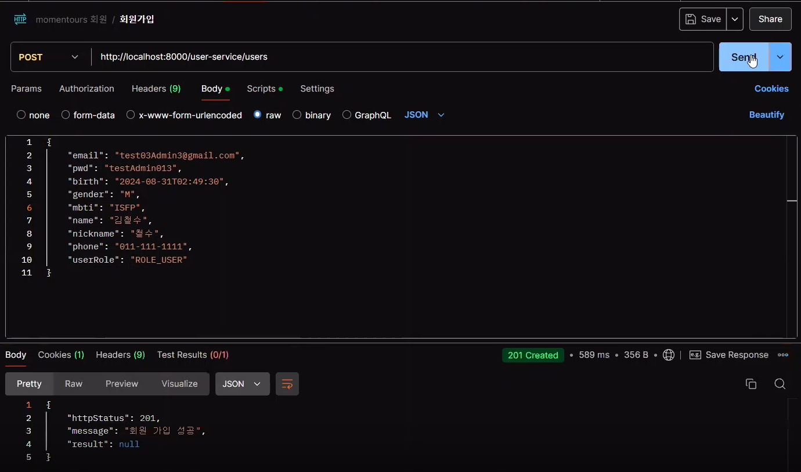
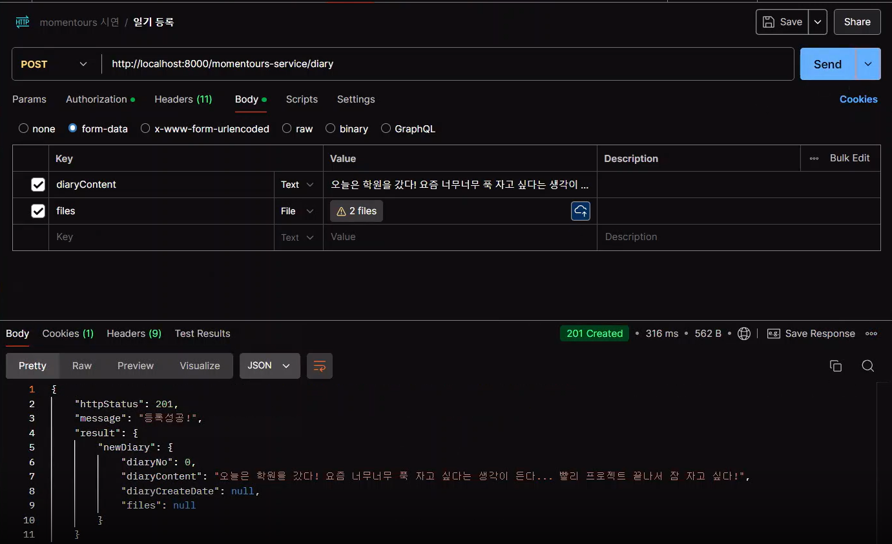
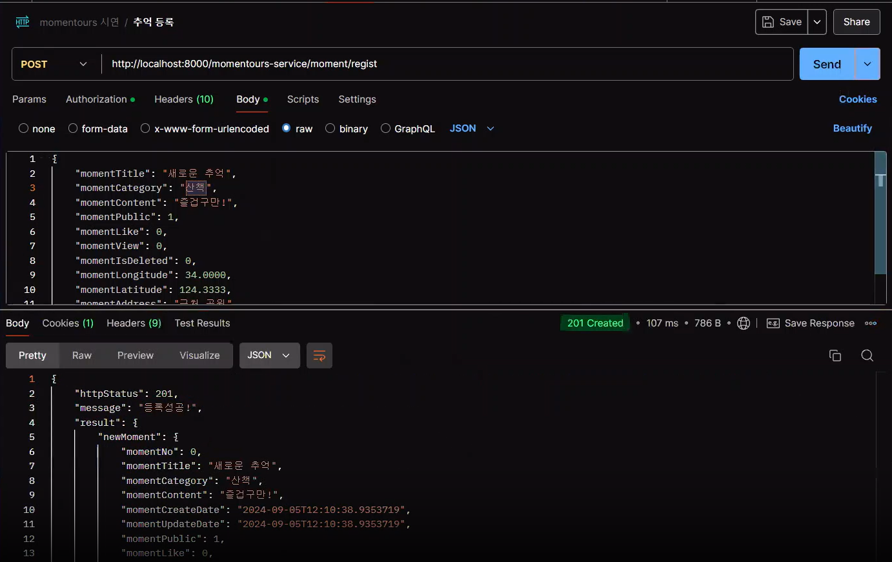
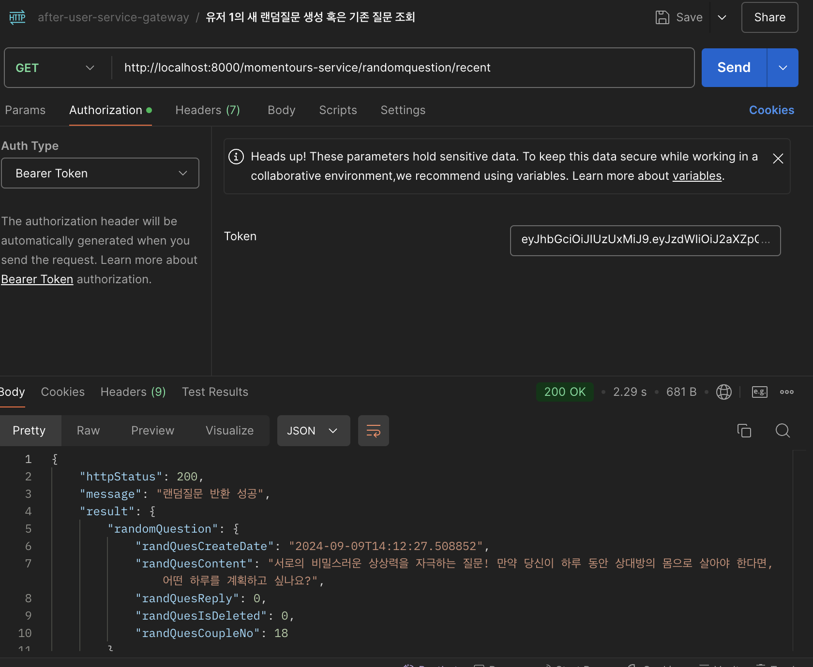

# "우리의 특별한 순간들" Momentours
| 커플을 위한 가장 완벽한 기록 서비스

## 🤝TEAM
| ||||| |
| :------------------------------------: | :-------------------------------------: | :-----------------------------------: | :--------------------------------------: | :-----------------------------------: | :------------------------------------------: |
| [🦖최해관](https://github.com/Haegwan-Choe) | [🐰유혜진](https://github.com/yuhyejin) | [😇장민근](https://github.com/caolian2003) | [👀이우진](https://github.com/Vorschlag-bit) | [😺김동혁](https://github.com/dongkh9) | [🐶김정모](https://github.com/mojeeeeong) |

## 기술스택

## 협업 툴

## 전체 프로젝트 일정
**프로젝트 일정 : 2024년 08월 26일 ~ 2024년 09월 05일**

### 목차

- [1. 프로젝트 개요](#1-프로젝트-개요)
- [2. 국내외 유사 서비스와 차별성](#2-국내외-유사-서비스와-차별성)
- [3. 요구사항 명세서](#3-요구사항-명세서)
- [4. 프로젝트 설계](#4-프로젝트-설계)
- [5. 프로젝트 수행 결과](#5-프로젝트-수행-결과)
- [6. 프로젝트 수행 체계](#6-프로젝트-수행-체계)
- [7. 팀 회고](#7-팀-회고)
- [8. 참고문헌](#8-참고문헌)

---

## 1. 프로젝트 개요
| 연인과의 소중한 추억을 기록하고, 여러분만의 데이트 코스를 공유하고 추천받는 웹 서비스 입니다.

### 1.1 프로젝트 소개

**소중한 연인과의 기억을 간직하고 다양한 데이트 코스를 알아보세요**

✔️ 우리의 소중한 기억을 지도 위에 기록하세요

✔️ 다른 커플은 어디서 어떻게 놀까?

✔️ 맛집, 카페, 액티비티 등 취향에 맞는 데이트 코스

---
### 1.2 프로젝트 배경

------

## 2. 국내외 유사 서비스와 차별성

---
## 3. 요구사항 명세서

---
## 4. 프로젝트 설계

### 4.1 Event Stroming을 통한 DDD 설계 Aggregate

---
### 4.2 Domain

---
### 4.3 Bounded Context

---
### 4.4 데이터베이스 모델링

#### (1) 논리 모델

#### (2) 물리 모델

---
## 5. 프로젝트 수행 결과

### 5.1 API Test
- 회원가입
  

- 일기 등록
  

- 추억 등록
  

- 랜덤 질문 생성
  

---
## 6. 프로젝트 수행 체계
---
### 6-1. 팀원 인적사항

|이름|이메일|학과|희망직무|
|------|---|---|---|
|최해관|kkhagwan@naver.com|불교학부, 융합소프트웨어|백엔드개발자, PM|
|김정모|am1607@naver.com|생명화학공학과|백엔드개발자, 솔루션 아키텍처|
|유혜진|hj_eu@naver.com|소프트웨어학과|백엔드개발자|
|이우진|bustout@naver.com|생명화학공학과|백엔드개발자|
|김동혁|dongkh99@gmail.com|경제학부|백엔드개발자|
|장민근|caolian2003@naver.com|컴퓨터공학부|백엔드개발자|

---
### 6.2 프로젝트 수행 방법

#### (1) Github project & Milestone & Issue
Milestone을 Domain 별로 설정하고 각 이슈를 생성하여 진행하였다.
Project를 열어서 전체적인 진행 상황 관리를 한 눈에 파악하도록 했다.

---

#### (2) Discord Webhook
Discord Webhook 기술을 이용해 Github에 commit, push, branch 생성, issue open & close, Pull request 시
채널을 통해 알림을 보내고 팀원들이 즉각적으로 확인할 수 있게 했다.

---
## 7. 팀 회고
#### 최해관
> **유혜진**: 
> 해관님은 프로젝트 내내 아이디어를 많이 내시고 프로젝트를 어떤식으로 하면 좋을지 의견을 많이 얘기해 주셔서 방향성을 잡는데 매우 좋았습니다! 어떤 선택지를 고를까 고민하고 있으면 늘 확실한 답을 가져와서 든든했습니다. 중간 발표 때 PPT도 잘 만들고 monentoures 서비스의 핵심 내용을 딱딱 뽑아서 발표도 아주 잘했습니다! 백엔드 개발을 진행하면서 맡은 기능을 끝까지 하려고 노력하는 모습이 열정적으로 느껴져서 저도 열심히 할 수 있었습니다! 프론트도 열심히 개발하자!!

> **김정모**: 
> 팀에 어려움이 생길 때마다 빠르게 문제를 해결해줘서 큰 도움이 되었다. 해관이의 해결 능력 덕분에 프로젝트가 잘 진행될 수 있었다.

> **김동혁**: 
> 항상 독창적이고 기발한 아이디어를 프로젝트 회의 때 마다 보여주신 덕분에 프로젝트의 큰 가닥이 비교적 빠르게 잡혀갔던 것 같습니다. 좋은 아이디어와 함께, 아이디어를 구체화하는 과정에서도 주도적으로 회의를 이끌어 주셔서 프로젝트가 무척 수월하게 진행되었다고 생각합니다. 아이디어를 구체화하는 방법에 대해 배울 수 있었습니다.

> **장민근**: 
> 팀원끼리 회의를 할 때 눈치보지 않고 자신의 의견을 자신있게 내는 모습이 좋았어요. 말 자체도 조리있게 잘 해서 팀원들이 대화의 핵심을 파악하기 쉽게 해주셨어요. 또한 맡은 바 책임을 다해 끝까지 완주해주시는 모습 또한 멋졌습니다.

> **이우진**: 
> DB에 관한 이해도가 높으며 저희 팀 핵심 도메인인 추억을 담당했습니다. 메인인만큼 많은 기능들이 있었는데 훌륭하게 구현해냈으며, 특히 생각만큼 전혀 단순하지 않았던 좋아요와 조회수 관련 기능을 담당해줘서 다른 도메인에서도 작업에 대한 부담을 줄일 수 있었습니다. 항상 밝은 분위기로 팀의 사기가 떨어질 때마다 분위기를 환기하시고 다들 처음 배운 프로젝트 구조인 cqrs에 대해 빠르게 이해하여 다른 조원에게 설명을 해주는 등 팀원을 누구보다 가장 아끼고 챙기는 모습을 보여주셨습니다. 또한 건강 악화로 인해 오프라인으로 함께 못하는 상황에 처해있을 때도 본인 기능을 늦은 밤까지 구현하면서 책임감을 갖춘 모습도 보여주셨습니다. 

#### 유혜진
> **최해관**: 
> 팀의 계획 담당 열정러!! 문제가 발생하면 바로바로 피드백을 주고 도맡아서 세세한 부분을 수정하는 열정이 대단합니다. 계획에 전부 따라주진 못했지만 전체적인 틀을 잡느라 고생하셨습니다! 발표랑 테스트 코드 시연까지 고생하셨어요!

> **김정모**: 
> 자신의 일을 책임감 있게 잘 해내면서, 다른 팀원들도 적극적으로 도와줘서 프로젝트가 순조롭게 진행될 수 있었다. 항상 팀을 생각하며 도와준 덕분에 팀 분위기도 좋게 유지되었다.

> **김동혁**: 
> 프로젝트를 진행하면서 다른 팀원들이 놓치기 쉬운 부분들을 꼼꼼히 챙겨 프로젝트가 정해진 일정 안에 완성되는데 큰 도움이 되었습니다. 프로젝트가 진행되면서 큰 목표에 맞게 수행하는 것도 중요하지만, 그만큼 작은 목표들도 소홀히 해서는 안된다는 점을 배울 수 있었습니다.

> **장민근**: 
> 자신에게 주어진 역할에 대해 책임감 있게 대하는 자세가 멋졌어요.
다른 팀원분들과 마찬가지고 한 번 맡은 일은 쉽게 놓지 않는 끈기 있는 자세가 좋았어요.
또한 예기치 못한 상황에도 좌절하지 않고 끝까지 해결하려는 모습이 인상적이었어요.

> **이우진**: 
>  DB 관련해서 스크립트와 논리, 물리 모델 설계 및 제약 조건 추가를 담당하고, 가장 많은 도메인까지 담당해서 우리 프로젝트 내에 명실상부 최고 기여자라고 생각합니다. 저번 조부터 느낀 점이지만, 모르는 게 있어서 물어보면 언제나 친절하게 답변해주고 전공자 + 현직 경험자의 모습이 프로젝트를 진행할수록 드러나서 개인적으로 정말 멋있다고 느꼈습니다. 맡은 도메인도 저희 프로젝트의 핵심 도메인 중 하나의 일기와 서브 도메인인 추억 코스를 소화하면서 특히 일기와 깊은 연관이 있던 파일을 따로 서브 도메인으로 만드는 등 세세한 처리를 한 점이 매우 인상 깊었습니다. 또한 단순히 빠르게 개발을 하는 것뿐만 아니라 기능을 완성하고 리팩토링 과정을 꾸준히 거치면서 프로젝트에 대한 책임감을 갖고 자기 도메인외에도 처음 겪는 스프링 프로젝트로 힘들어하는 팀원들의 챙기는 점 역시 동료의 소중함을 깨달을 수 있었습니다. 프론트 역시도 분명 적극적인 태도로 팀원들을 챙기며 소화해 나갈 거라고 믿으며 어느 사람과 어떤 프로젝트를 하더라도 잘 녹아들어갈 사람입니다.

#### 김정모
> **최해관**: 
> 팀의 분위기 메이커, 자랑스러운 맏형! 프로젝트로 피곤할 때마다 팀원들의 사기를 복돋고, 본인도 많이 힘들텐데도 좋은 분위기를 만들어 주셨습니다. 항상 팀원들의 말을 경청하고 흘려 듣지 않는 점을 배우고 싶습니다.

> **유혜진**: 
> 정모님은 항상 남아서 공부하시는데 보면서 동기부여를 많이 받았습니다! 프로젝트를 진행하면서 처음이다 보니 많이 어려워했지만 그래도 알려주면 잘 따라와서 척척 기능 개발을 진행했습니다. spring을 배우면서 프로젝트를 하다 보니 시간이 많지 않았지만 그래도 모르는 것이 있으면 팀원들에게 물어보면서 포기하지 않고 끝까지 해줘서 고맙고 프론트 하면서 더 성장해 봅시다!!!

> **김동혁**: 
> 팀 모임이 있을 때 마다 분위기를 너무 딱딱하지 않고 유쾌하게 만들어주셔서 프로젝트 기간 내내 즐겁게 팀 활동을 할 수 있었습니다. 적극적인 소통으로 팀 전체의 의견 교환이 활발해져 프로젝트 진행이 수월했습니다. 같은 팀원으로서 의사소통의 방법을 배울 수 있었습니다.

> **장민근**: 
> 마찬가지로 경험해보지 못했던 일에 대한 두려움과 막연함을 이겨내고 자기의 몫을 끈기있게 다 했다는 점에서 제가 본받아야할 점이라고 생각해요. 또한 팀원들에게 항상 친근하게 대해서 상대로 하여금 편하게 느끼게 하는 점이 좋았어요.

> **이우진**: 
> 정모: 저와 마찬가지로 비전공자로서 개발이라는 일을 시작한 지 불과 3달도 안 지난 상태로 이번 프로젝트를 겪으면서 정말 많은 걸 배웠을 거라고 생각합니다. 저희 도메인 중 예정 코스 도메인을 맡아서 구현과 spring 공부를 동시에 병행하느라 함께 고생했지만 그래도 포기하지 않고 끝까지 맡은 바를 수행하셨습니다. postman을 통한 기능 테스트를 할 때 세세하게 테스트를 하면서 오류를 검증하셨습니다.

#### 김동혁
> **최해관**: 
> 다들 끙끙 앓고 있을 때마다 어느 순간 등장해서 모든 문제를 해결하는 우리 팀의 해결사. 본인이 제대로 이해한 것이 맞는지 확인하는 등 항상 소통을 게을리 하지 않고 다른 사람들이 모르는 점에 대해서도 친절히 설명해주셔서 감사합니다.

> **유혜진**: 
> 프로젝트 하면서 소통을 제일 많이 했던 동혁님! 이번 프로젝트 때 정말 많은 도움을 주셔서 감사했습니다! 저번 조에서도 대화를 하다가 이상한 곳으로 튀면 바로잡아주셨는데 이번에도 역할을 잘 해주시고 개발하면서 문제가 생기면 의견 공유도 많이 해주시고 MSA 부분 맡으면서 고생 많이 하셨는데 앞으로 더 열심히 잘 부탁드립니다!! 프론트까지 완벽하게 할 수 있도록 열심히 합시다!!!

> **김정모**: 
> 팀을 이끌며 전체적인 방향을 제시해줘서 모두가 혼란 없이 프로젝트를 진행할 수 있었다. 동혁이의 리더십 덕분에 팀이 목표를 잘 향해 나아갈 수 있었다.

> **장민근**: 
> 스스로 해야할 일을 찾아서 진행합니다. 하나하나 가르쳐 주지 않아도 본인 스스로 찾아서 처리하고, 회의에서 더 논의가 필요한 부분에 대해서 직접 찾아보고 공유해 주는 모습이 매우 인상적입니다.
또한 프로젝트 중간중간 에러 발생시 즉각적으로 대응해주시는 모습이 인상적이었어요

> **이우진**: 
>  DB에서 트리거와 이벤트 쿼리를 만들고 프로젝트 전반에 걸처 항상 팀의 방향성을 정해주는 데에 결정적인 역할을 수행했습니다. spring과 프로젝트 구조에 대해서 정말 높은이해도를 바탕으로 모든 조원들에게 자신이 아는 한에 있어서 항상 친절히 설명해 주셨습니다. 덕분에 조원들이 의견이 갈리거나 방향성을 못 잡고 방황하는 순간마다 날카로운 통찰력으로 프로젝트를 이끌어 나갔습니다. 뿐만 아니라 회원 도메인과 유레카 서버와 게이트 웨이 서버, 인증 토큰, 헤드 필터 클래스를 혼자서 담당하셔서 구현하셨고 특히 토큰과 인증관련된 사항에 있어서 모두들 어려워하던 차에 빠른 이해도를 바탕으로 토큰을 통한 다른 도메인 간의 통신 흐름을 잘 설명해주셔서 덕분에 보다 쉽고 빠르게 프로젝트를 도메인 설계를 수행할 수 있었습니다.

#### 장민근
> **최해관**: 
> 프로젝트 주제의 기둥을 세운 민근님! 다들 머리를 싸매고 어떤 주제가 좋을까 하던 와중에 민근님이 생각한 주제는 재밌고 기발한 것이었습니다. 덕분에 무사히 백엔드 프로젝트 종료 시까지 큰 변화 없이 꾸준히 개발할 수 있었습니다.

> **유혜진**: 
> 항상 진중하고 이해하려고 노력하고 그러기에 꼼꼼한 민근님! 이번 프로젝트 진행하면서도 DDD 작성하거나 DB 설계할 때 꼼꼼하게 보면서 이해하다가 이상한 거 있으면 바로 말해주시고 같이 얘기하면서도 의견을 내셔서 늘 팀원들과의 대화에서 놓치는 부분을 캐치해 주십니다! 개발을 시작하고서도 하나하나 꼼꼼하게 생각하면서 개발하시는 모습이 좋았습니다! 앞으로 프론트도 열심히 달려가 봅시다!

> **김정모**: 
> 항상 배우려는 자세로 열심히 질문하고 학습한다. 덕분에 자신의 일도 잘 해냈고, 팀원들과도 많은 지식을 나눌 수 있었다.

> **김동혁**: 
> 팀 회의를 진행하며, 의견이 잘 모이지 않거나 너무 흩어질 때에는 항상 민근님께서 중심을 잡아주셨던 기억이 납니다. 모두의 의견을 경청해주시고, 의견을 모아 정리해주셔서 프로젝트 내내 회의시간을 알차게 보냈습니다. 경청의 자세와 의사소통의 방법을 배울 수 있었습니다.

> **이우진**: 
> 프로젝트 초반 아이디어 회의 때 항상 적극적인 자세로 임하시며 저희 프로젝트의 주제를 나오도록 활발한 소통능력을 보여주셨습니다. 처음하는 spring 프로젝트에서 회원이라는 가장 큰 도메인을 처음에 맡으셔서 많이 고생하셨지만 crud를 구현하셨고 저와 서로 모르는 점이 있을 때마다 의견을 주고 받으면서 프로젝트 흐름과 spring의 동작 원리에 대한 이해를 높일 수 있었습니다.

#### 이우진
> **최해관**: 
> 항상 모르는 기술에 대해 열심히 공부한 뒤 그것을 반영하려는 모습이 인상 깊었습니다. 이번 프로젝트에서도 다른 도메인에 비해 가장 이질적인 도메인에 외부 시스템과 AI를 도입하느라 정말 고생 많으셨습니다. 끈질기게 파고 드는 모습 배우고 싶습니다.

> **유혜진**: 
> 우진님은 저번에 같은 조 하면서도 느꼈지만 정말 열정적이고 하나하나 꼼꼼하게 생각합니다. DB 설계와 백엔드 개발을 하면서도 항상 기능에 대해 고민하고 또 고민하면서 코드를 어떻게 작성해야 좋은지 많이 고려합니다. 정말 보고 배울 점이 많고, 자기가 맡은 게 있으면 꼭 끝까지 해내는 성격인 것 같습니다! 앞으로 남은 프론트도 같이 지금처럼 잘 준비해서 완벽하게 해내봅시다!

> **김정모**: 
> 언제나 차분하고 긍정적인 태도로 문제를 해결한다. 어려운 상황에서도 침착하게 문제를 해결하는 모습이 팀에게 큰 도움이 되었다.

> **김동혁**: 
> 프로젝트 요구사항 중 외부 API를 이용하는 요구사항을 담당하셨습니다. 다소 어려운 목표였지만 맡은 일을 빈틈 없이 완수해주셔서 프로젝트의 완성도가 한 층 높아졌습니다. 새로운 일에 도전하는 모습을 보며 저 또한 새로움에 도전할 수 있는 용기와 마음가짐을 배울 수 있었습니다.

> **장민근**:
> 본인 영역 외에도 관심을 가지고 노력하는 자세가 좋은 것 같아요.
한 번도 해보지 않았던 일에 대해서도 자신이 맡은 일은 끝까지 책임 지려는 모습을 보고 본받아야할 자세라고 느꼇어요. 

---
## 8. 참고 문헌
